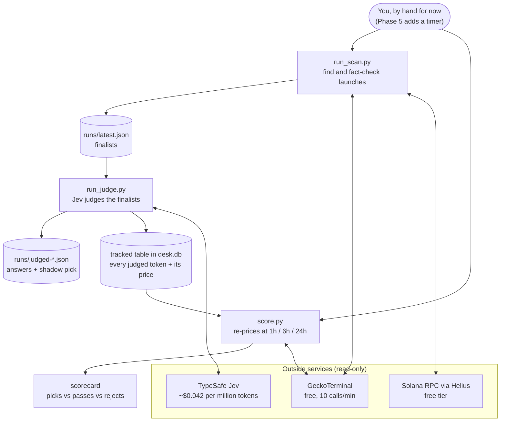
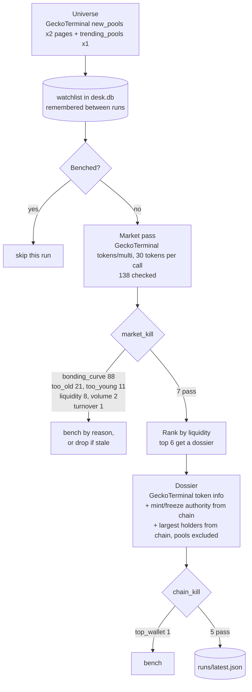
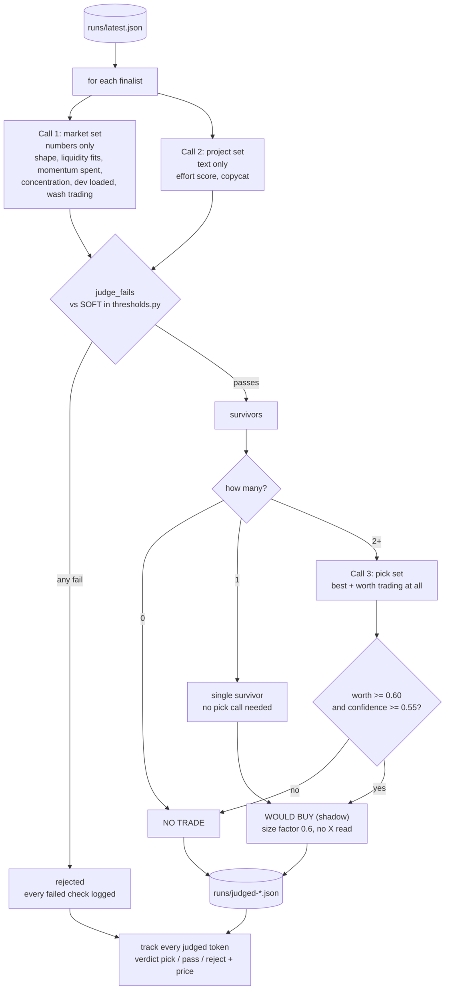
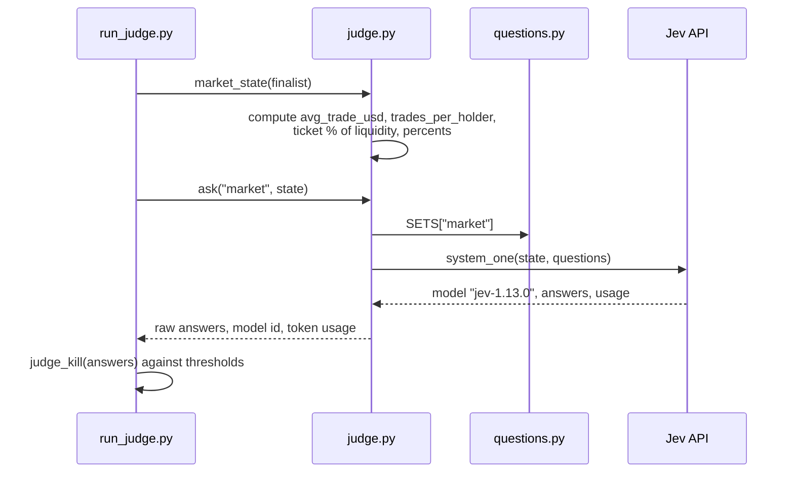
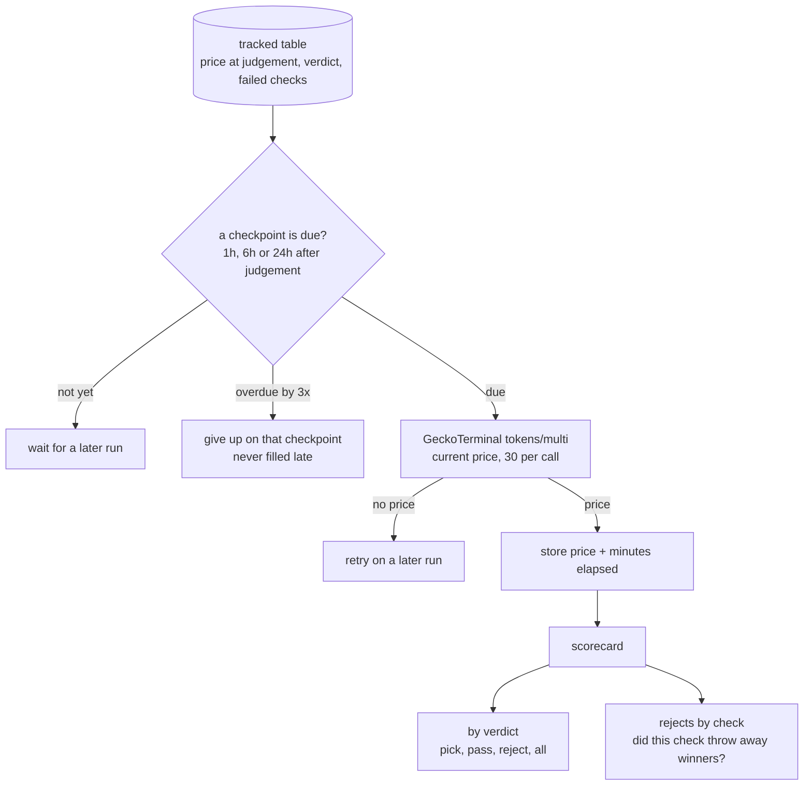
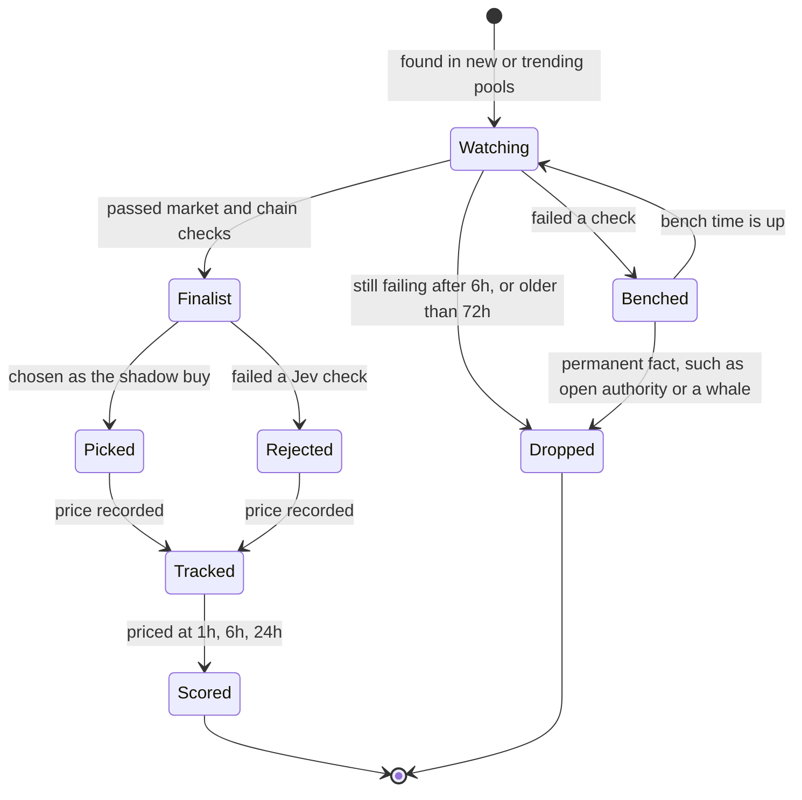
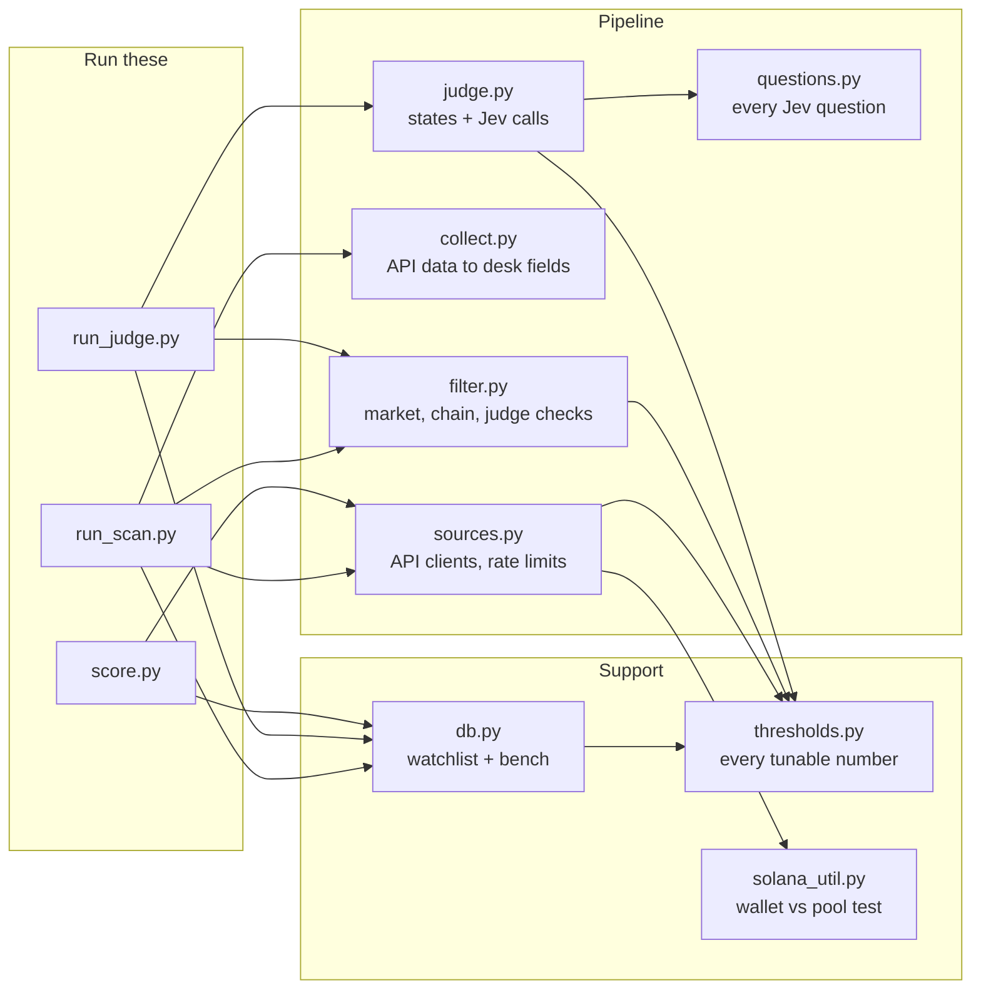

# jev-desk architecture

How the project works, top to bottom. GitHub renders the diagrams below automatically.
This file is updated with every phase; see `CHANGELOG.md` for the history.

**Current state:** Phases 1–4 built. Shadow mode only: the desk never holds keys or money.

## 1. The big picture

## 2. The scan: from ~140 launches to a handful of finalists

Each stage costs more than the one before it, so each one has to reject harder.
Numbers on the arrows are from the 2026-10-08 evening run.

### The checks, in the order they fire

| Stage | Check | Rejects when | Source |
|---|---|---|---|
| market | `bonding_curve` | still on a launchpad curve (pump-fun, meteora-dbc, ...) | GeckoTerminal dex id |
| market | `too_young` / `too_old` | under 15 minutes or over 72 hours | first pool time |
| market | `liquidity`, `volume`, `mcap`, `trades` | below the floors in `thresholds.py` | GeckoTerminal pool |
| market | `turnover` | 24h volume more than 20x market cap | computed |
| market | `no_sells` | buys going through but no sells | GeckoTerminal pool |
| chain | `authority_open` / `authority_unknown` | mint or freeze still set, or unreadable | Solana chain |
| chain | `holders_unknown` | holder lookup failed | Solana RPC |
| chain | `top_wallet` / `top_10` | one wallet over 5%, top ten over 60% | Solana RPC, pools excluded |
| chain | `holders` | fewer than 80 holders | GeckoTerminal |

## 3. The judge: Jev's typed answers

**Code fetches, Jev judges, code decides.** Jev only returns probabilities. Every
yes/no line lives in `thresholds.py`, and every piece of arithmetic (average trade
size, trades per holder, ticket share of liquidity) is computed in `judge.py` before
the call.

### What a Jev call looks like

## 4. The scorekeeper: did the desk's calls hold up?

Returns are measured from the price at judgement and shown after an assumed 3%
round-trip cost (`ROUND_TRIP_COST_PCT`). "Win" is the share of tokens that would have
made money after that cost. A token judged again within 24 hours is not tracked again,
so busy tokens don't count many times; a pick is always recorded.

The scorecard warns until each group has 30+ results at 24h. Before that, differences
are noise.

## 5. A token's life

Bench lengths depend on why a token failed, so facts that will never change (an open
mint, a 7% whale) sit out for good, while "too young" or "no pool yet" come back within
minutes.

## 6. Files and who calls whom

## 7. Where data lives

| Place | What | Kept in git? |
|---|---|---|
| `.env` | Jev key, Helius RPC URL, `RPC_PER_MINUTE` | **never** |
| `desk.db` | watchlist, bench and tracked outcomes (SQLite) | no |
| `runs/latest.json` | finalists from the last scan | no |
| `runs/judged-*.json` | every Jev answer, model id, and shadow pick | no |
| everything else | code and docs | yes |

## 8. Roadmap

| Phase | What | Status |
|---|---|---|
| 1 | Pi setup, keys, API tests | done |
| 2 | Scanner with market and chain checks | done |
| 3 | Jev judges the finalists | done |
| 4 | Shadow scorekeeper: every judged token re-priced at 1h / 6h / 24h | **built, testing on the Pi** |
| 5 | Run unattended every 15 minutes (systemd timer) | next |
| 6 | Review the scorecard; decide whether execution is worth building | planned |
| later | Dashboard served from the Pi; optional X reading via xAI | ideas |
