# jev-desk architecture

How the project works, top to bottom. GitHub renders the diagrams below automatically.
This file is updated with every phase; see `CHANGELOG.md` for the history.

**Current state:** Phases 1–5 built: the desk runs itself every 15 minutes. The dashboard is
being built (steps 1–3 of 4 done). Shadow mode only: it never holds keys or money.

## 1. The big picture

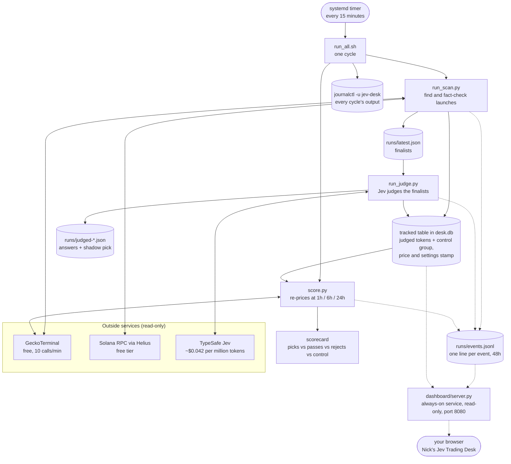

### One cycle, step by step

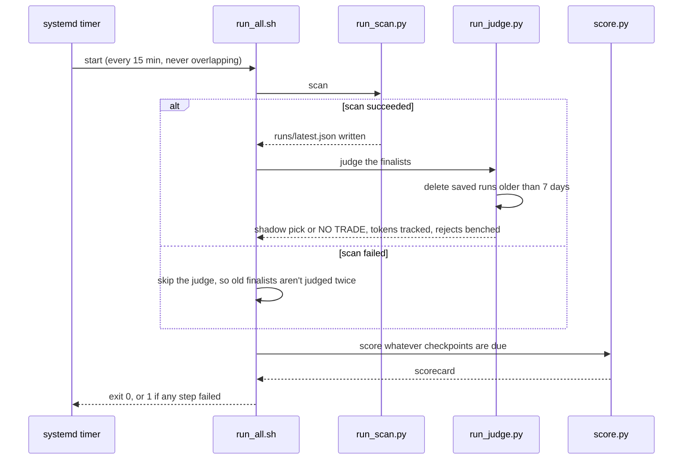

### The dashboard

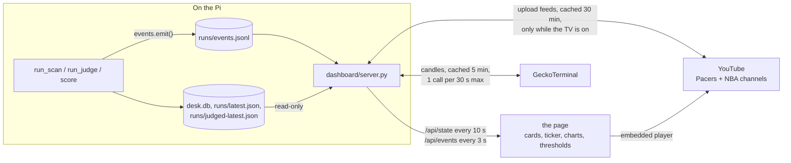

**Page layout.** The eight stage cards run down the left side; the floor sits right of
them, directly under the title, and stretches to the cards' height. Below both, one
row: shadow P&L, Jev analysis, `thresholds.py`. On a 1080p screen almost everything
fits without scrolling.

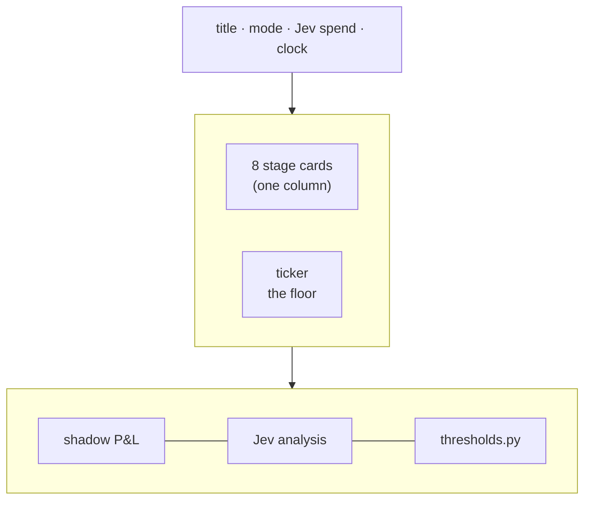

**The floor** (`office.js`) is a detailed pixel-art office drawn in code. Nothing is an
image file. The room is 300 art-pixels tall and as wide as its panel. The six work
desks stay centred, and the side areas stretch to fill the space. On a narrow screen
the room keeps its minimum width and the ceiling gets higher instead.

- **Look:** outlines, three-tone shading, rim light, monitor light on desks and faces,
  a perspective floor, faint scanlines and a vignette.
- **Fixed parts:** the wall, floor, rug and frames are drawn once into a cached
  background and redrawn only on resize.
- **Characters:** each body is rendered once into a small sprite. Eyes, arms and
  glow are drawn each frame.
- **Working:** the character whose stage is running glows, types fast and looks at
  its screen, and its monitor brightens.
- **Real data on the walls:** the wall screen shows candles, and the left wall shows
  the finalist chips and the verdicts judged today. The clock and today board are
  on the right. The scoreboard shows the last 14 tokens' 1h results.

| Stage | Character | Where | Its monitor shows |
|---|---|---|---|
| Desk (the cycle) | white ghost with a headset | head desk (right) | — |
| Scout | blue circle with an antenna | desk 1 | radar sweep |
| Market | green blob with a tie | desk 2 | volume bars |
| Dossier | red square with glasses | desk 3 | rows being checked |
| Jev·Market | pink triangle with a halo | desk 4 | a price line |
| Jev·Text | teal diamond with a halo | desk 5 | text being read |
| Pick | orange spiky with a star | desk 6 | three candidates, one chosen |
| Scorekeeper | violet bean with a clipboard | by the scoreboard | — |

**The show** (also `office.js`) turns events into animation. Each live event from
`/api/events` becomes one step: a speech bubble, a character walking somewhere, or a
trip for **the courier cat**, an orange cosmic kitten. It flies work between desks,
holding it in its front paws, and leaves a trail of stardust. Steps play one at a time, and when events arrive faster
than they can be shown the steps speed up rather than fall behind. Only events that
happen while the page is open are animated.

Between cycles, after 20 seconds and then every 4 minutes, the page replays the last
finished cycle (`/api/cycle`) in about 40 seconds. A pink **REPLAY** tag sits under the
wall screen while it plays, and a live event stops the replay at once.

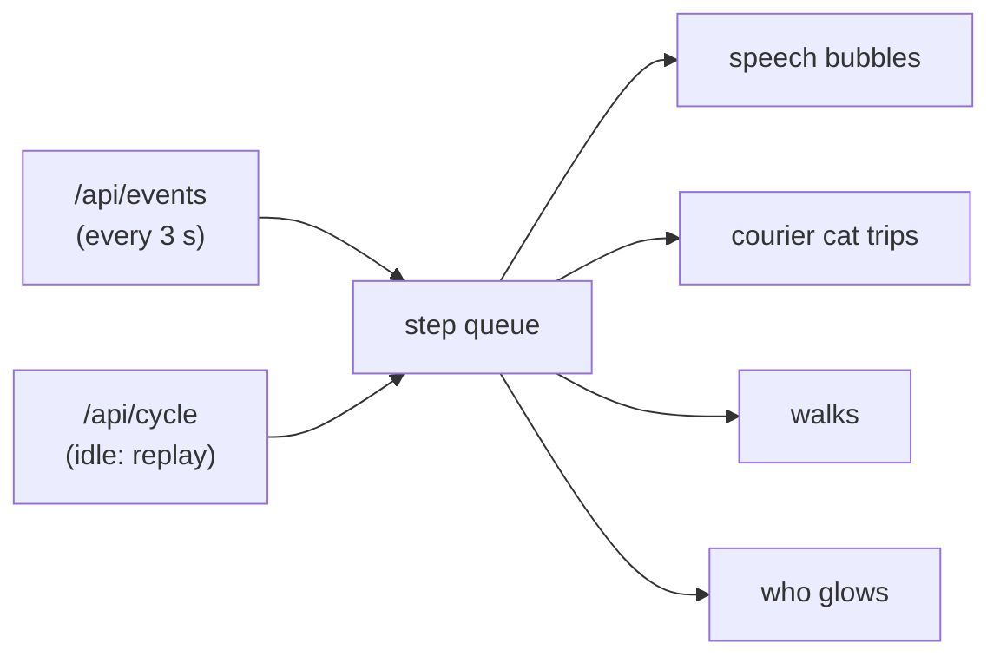

| Event | On the floor |
|---|---|
| `scout.start` | Desk: "new cycle, go!" · Scout: "scanning launches…" |
| `scout.done` | Scout reports new launches; the cat flies the batch to Market |
| `market.token` (passes only) | Market: ticker ✓ and its liquidity |
| `market.done` | Market reports how many passed; the cat flies them to Dossier |
| `chain.token` | Dossier: ✓ clean, or ✗ reason and a paper ball into the bin |
| `chain.done` | Dossier reports the finalists; the cat flies them to Jev·Market |
| `jev.token` | Jev·Market says the launch shape, Jev·Text the verdict. A reject is balled up into the bin; the cat flies a survivor's chip to Pick |
| `pick.decision` | Pick walks to the head desk: "would buy X" or "no trade"; the Desk answers |
| `score.priced` | Scorekeeper walks to the scoreboard: ticker, checkpoint, result after cost |
| `desk.cycle_end` | Desk: "cycle done ✓" (or the failure code) |

**The TV** sits in the break corner on the left of the floor. The 📺 PACERS TV button
in the top bar, or a click on the TV or the remote on the couch, turns it on. The
screen warms up like an old CRT, then YouTube's own embedded player
(youtube-nocookie.com) plays the latest Pacers highlights in a loop, laid exactly over
the TV's screen. Nothing is downloaded or stored.

- **Where the list comes from:** the server reads the public upload feeds of the Pacers
  and NBA channels (no API key). It keeps titles with "highlight", plus "Pacers" for the
  NBA channel, and caches the list for 30 minutes. It only fetches while someone has
  the TV on. A playlist set as `TV_PLAYLIST` in `.env` always comes first; the feeds
  are only used without one. That is the only value the dashboard reads from `.env`, and it is
  never sent to the page except as the playlist id.
- **Small screens:** YouTube's player needs at least 200 px of height. Where the TV is
  smaller than that, the player pops out slightly larger over the floor, with a pink
  border.
- **Skipping:** ⏮ ⏭ on the cabinet move through the list and wrap around. After the last
  video it starts again from the first. This uses YouTube's IFrame Player API, loaded
  only the first time the TV is turned on.
- **Turning it off:** Esc, the button or the remote. The rest of the floor never pauses.

The dashboard only reads. Each card maps to a stage. The ticker shows events as they
land. The shadow P&L chart is the scorecard as a running total ($100 per token, after
cost). The analysis panel shows the selected finalist's candles and Jev's answers. The
thresholds panel shows every number in `thresholds.py` against that token.

## 2. The scan: from ~140 launches to a handful of finalists

Each stage costs more than the one before it, so each one has to reject harder.
Numbers on the arrows are from the 2026-10-08 evening run.

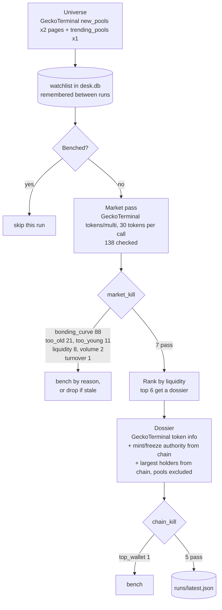

### The checks, in the order they fire

| Stage | Check | Rejects when | Source |
|---|---|---|---|
| market | `bonding_curve` | still on a launchpad curve (pump-fun, meteora-dbc, ...) | GeckoTerminal dex id |
| market | `too_young` / `too_old` | under 15 minutes or over 72 hours | first pool time |
| market | `liquidity`, `volume`, `mcap`, `trades` | below the floors in `thresholds.py` | GeckoTerminal pool |
| market | `turnover` | 24h volume more than 20x market cap | computed |
| market | `no_sells` | buys going through but no sells | GeckoTerminal pool |
| chain | `authority_open` / `authority_unknown` | mint or freeze still set, or unreadable | Solana chain |
| chain | `holders_unknown` | holder lookup failed | Solana RPC |
| chain | `top_wallet` / `top_10` | one wallet over 5%, top ten over 60% | Solana RPC, pools excluded |
| chain | `holders` | fewer than 80 holders | GeckoTerminal |

## 3. The judge: Jev's typed answers

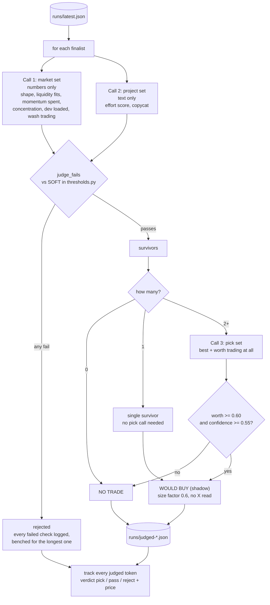

**Code fetches, Jev judges, code decides.** Jev only returns probabilities. Every
yes/no line lives in `thresholds.py`, and every piece of arithmetic (average trade
size, trades per holder, ticket share of liquidity) is computed in `judge.py` before
the call.

### What a Jev call looks like

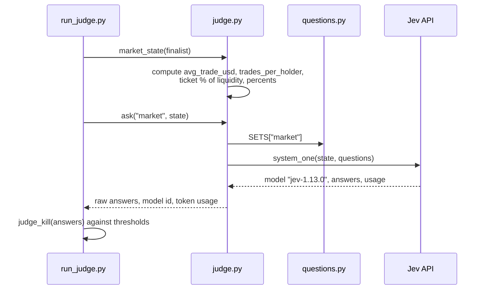

## 4. The scorekeeper: did the desk's calls hold up?

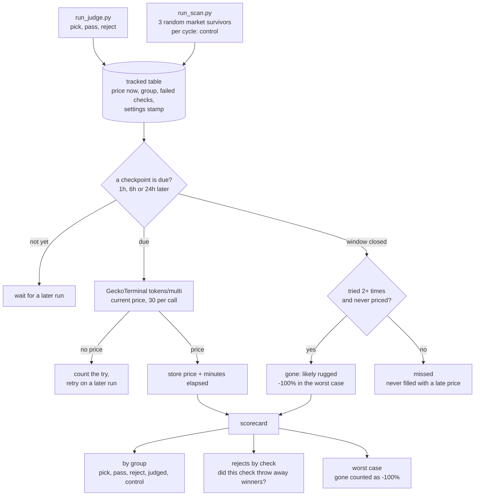

**The control group** is the baseline. Each scan tracks 3 random tokens that passed the
free market check (`CONTROL_PER_CYCLE`), without any chain check or Jev. They are priced
exactly like judged tokens. Jev is only worth paying for if its passes beat the control
group. The control group is deduplicated on its own, so a token can be in both.

**Gone vs missed.** A checkpoint whose window closes after 2+ tries with no price at all
(`GONE_AFTER_TRIES`) is "gone": the token most likely rugged or was delisted. Leaving
these out would make every group look better than reality, so the scorecard adds a
worst-case table with gone checkpoints counted as −100%. "Missed" now means too few
tries, for example because the Pi was off.

**The settings stamp** (`settings_stamp.py`) is an 8-character code for everything that
decides a verdict: the decision settings in `thresholds.py` plus `questions.py`,
`judge.py` and `filter.py`. Every tracked token carries the stamp in force when it was
tracked, and the `settings` table remembers what each stamp meant. After a tuning
change, `python score.py --settings current` shows only tokens judged under the new
settings. Tokens tracked before stamps existed show as "unstamped".

Returns are measured from the price at judgement and shown after an assumed 3%
round-trip cost (`ROUND_TRIP_COST_PCT`). "Win" is the share of tokens that would have
made money after that cost. A token judged again within 24 hours is not tracked again,
so busy tokens don't count many times; a pick is always recorded.

Each checkpoint is only priced in a short window after it falls due
(`CHECKPOINT_WINDOW`: 30 min after 1h, 2 h after 6h, 6 h after 24h). With the timer
running every 15 minutes, checkpoints land within minutes of their mark.

The scorecard warns until pass and control each have 30+ results at 24h. Before that,
differences are noise.

## 5. A token's life

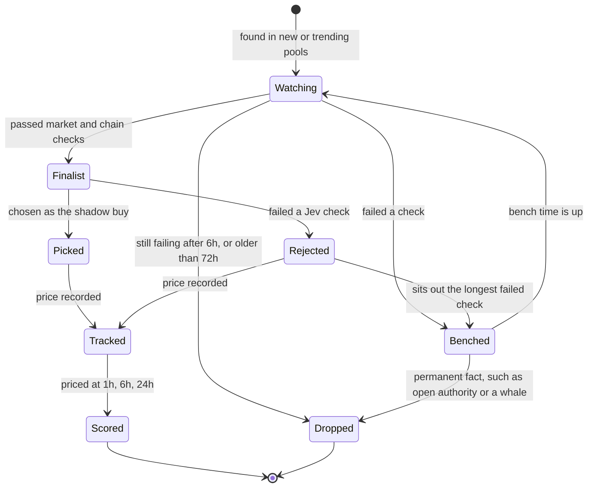

Bench lengths depend on why a token failed, so facts that will never change (an open
mint, a 7% whale) sit out for good, while "too young" or "no pool yet" come back within
minutes. Jev rejections bench too: 30 min for momentum or shape, 60 min for wash
trading, 90 min for concentration, 6 hours for effort or copycat. A token that failed
several checks sits out the longest, so dossier slots keep going to new tokens.

## 6. Files and who calls whom

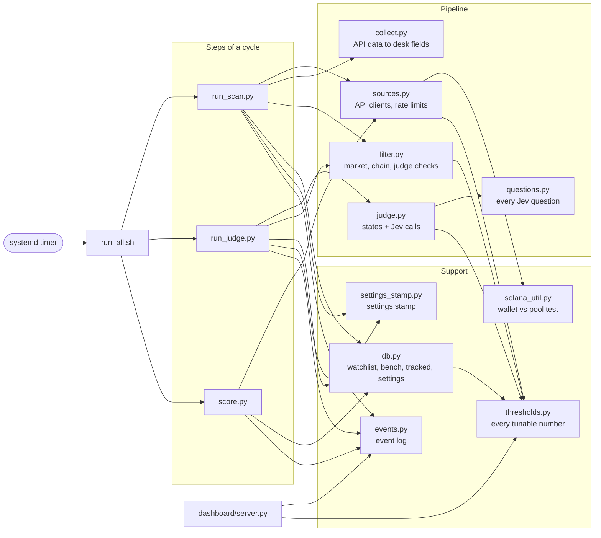

## 7. Where data lives

| Place | What | Kept in git? |
|---|---|---|
| `.env` | Jev key, Helius RPC URL, `RPC_PER_MINUTE` | **never** |
| `desk.db` | watchlist, bench, tracked outcomes and settings stamps (SQLite) | no |
| `runs/latest.json` | finalists from the last scan | no |
| `runs/judged-*.json` | every Jev answer, model id, and shadow pick; kept 7 days | no |
| `runs/events.jsonl` | the event log the dashboard reads; kept 48 hours | no |
| systemd journal | each cycle's output (`journalctl -u jev-desk`) | no |
| `/etc/systemd/system/jev-desk.*`, `jev-dashboard.service` | the installed timer and dashboard service, from `deploy/` | no (templates are) |
| everything else | code and docs | yes |

## 8. Roadmap

| Phase | What | Status |
|---|---|---|
| 1 | Pi setup, keys, API tests | done |
| 2 | Scanner with market and chain checks | done |
| 3 | Jev judges the finalists | done |
| 4 | Shadow scorekeeper: every judged token re-priced at 1h / 6h / 24h | done |
| 5 | Run unattended every 15 minutes (systemd timer) | done |
| D1 | Dashboard: event log, server, every panel on real data | done |
| D2 | Dashboard: the look, pixel office and characters | done |
| D2.1 | Dashboard: cards on the left, detailed pixel-art floor | done |
| D3 | Dashboard: the courier cat and event-driven animation, with replay | done |
| D4 | Dashboard: always-on service, control group on the page, docs | **built, testing** |
| 4.1 | Scorekeeper: control group, gone checkpoints, settings stamp | **built, collecting data** |
| 6 | Review the scorecard (1–2 weeks of data); decide whether execution is worth building | planned |
| later | Optional X reading via xAI | idea |
